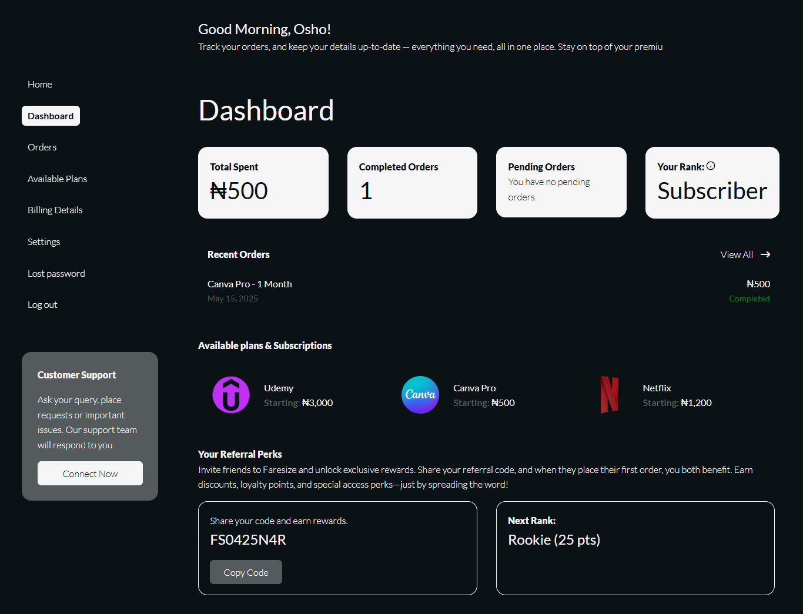
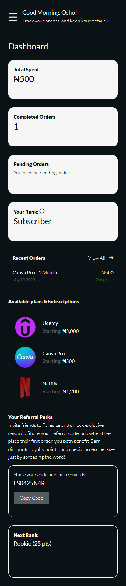

# Faresize Ultimate Dashboard Features

A custom WordPress plugin built for [Faresize.com](https://faresize.com), designed to enhance the user dashboard with powerful loyalty and referral-based features.

## 🎯 Features

- ✅ **Custom My Account Endpoints** — Adds new tabs to WooCommerce's My Account section.
- 🎁 **Loyalty Levels** — Automatically assigns user tiers based on total spend and usage.
- 💸 **Affiliate Codes** — Each user receives a unique code for referrals and rewards.
- 👥 **Referral System** — Tracks and rewards referred users and signups.
- 🚫 **Coupon Restrictions** — Limits coupon usage based on user level or referral status.
- 🔒 Fully integrated with WooCommerce and WordPress roles/capabilities.

## 📦 Installation

1. Download the plugin ZIP or clone the repository
2. Upload the plugin folder to /wp-content/plugins/
3. Activate it from the Plugins section in your WordPress admin dashboard.

## ⚙️ Dependencies
- WordPress 6.0+
- WooCommerce

## 🛠 Developer Notes
- Plugin is organized using OOP PHP principles.
- Hooks and filters used to keep it extensible and modular.
- Well-commented code for easy customization and updates.

## 📸 Screenshots
### 🎯 Custom Dashboard

## 💬 Support
For questions or suggestions, feel free to contact [Joshua](https://mail.google.com/mail/?view=cm&fs=1&tf=1&to=oshojoshua004@gmail.com)

Built with care by [Joshua](https://wa.me/2349049788099) for [Faresize.com](https://faresize.com).